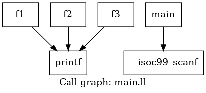
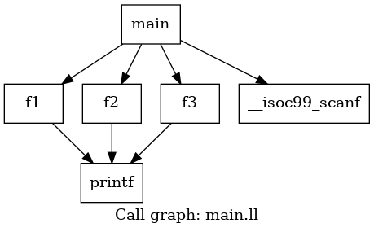

# PART2: Runtime Indirect Call Detection
[PART1: Indirect Call Detection](https://github.com/LittleLerry/llvm-pass-itargets/)

[PART2: Runtime Indirect Call Detection](https://github.com/LittleLerry/llvm-pass-icg/)

## What's the final goal?

Basically, we want to modify AFLGO to construct a more complete Control Flow Graph (CFG) than what 
we obtain from LLVM. The algorithm we will use consists of the following steps:

(1) Generate the target file using `llvm-pass-itargets` and run AFLGO;
(2) During runtime, detect extra indirect calls and obtain proper output with the given inputs;
(3) Combine the output in step 2 with the current CFG/CG to construct a new CFG/CG;
(4) If necessary, stop AFLGO to recalculate distances;
(5) Go back to step (1) and repeat the process;

The loop should be terminated at an appropriate time.

## What does this part do?

Detect extra indirect calls during runtime. 

## Methodology
### LLVM IR and instrumentation

LLVM IR (Intermediate Representation) is a low-level, platform-independent programming language 
used as an intermediate step during the compilation process in the LLVM (Low-Level Virtual Machine) 
framework. It serves as a common representation that allows various optimizations and transformations 
to be applied to the code before generating machine code for a specific target architecture. 

Instrumentation, in the context of LLVM, refers to the process of inserting additional code or instructions 
into a program to gather information or modify its behavior. Instrumentation can be used for various 
purposes, such as profiling, debugging, dynamic analysis, and security analysis. LLVM provides 
powerful tools and APIs to perform instrumentation on programs at the IR level.

### Idea illustration
We run the target program and monitor any indirect calls during runtime. Before each indirect call, 
we will insert an instruction and a function call. The first instruction will set a global variable 
`icf` to `0`, indicating that an indirect jump will occur. The function call will print the caller 
function to STDOUT because the author cannot handle string modification in the LLVM PASS.

For each basic block of Function `F`, we will check the global variable `icf`. If `icf == 0`, we will 
print the name of the currently running function and then set `icf` to `1` after the check. We will use 
another program `cg_iterator.py` to filter out the appropriate outputs.

For `cg_iterator.py`, it checks previously generated dot call graph and accepts instrumentation infomation 
from `STDIN`. The correspondding edges will be added to the graph. Then we output the graph in dot form.

Please note that the above statement will likely NOT hold for multi-threaded programs. The 
author has no idea what would happen if the target program were multi-threaded and cannot 
provide any guarantees or insights in that regard. And for `cg_iterator.py`, optimization MUST be applied 
otherwise we cannot terminate the whole loop in proper time.

## Core logic explaination
<del>
### Indirect function call instrumentation
We creates an `IRBuilder` and sets the insertion point of the `IRBuilder` to the current call instruction `CI`.
Then we use `CreateStore` to set the value of `icf` to `1`, indicating that the program will use indirect call 
soon. Finally we insert a function call instruction to print the name of current running function. Please note 
that passing one argument to `CreateStore()` is not available for LLVM.

```c++
      for (auto &BB : F) {
        for (auto &I : BB) {
          if (CallInst *CI = dyn_cast<CallInst>(&I)) {
            Function *calledFunction = CI->getCalledFunction();
            if (!calledFunction) {
                // IRBuilder init
		IRBuilder<> ins_builder(context);
                ins_builder.SetInsertPoint(CI);  

                // set to 1
                ins_builder.CreateStore(ConstantInt::get(Type::getInt32Ty(context), 1), icf);

                // basic print related arguments
		Value *formatString = ins_builder.CreateGlobalStringPtr("\n__ICG_STDOUT__:"+functionName+"->");

                // insert call
		ins_builder.CreateCall(printfFunc, {formatString});
            }
          }
        }
      }
```
### Caller-callee print instrumentation
We retrieve the first non-PHI instruction within the basic block using `getFirstNonPHI()`. And create an IRBuilder 
named `print_builder` with the insertion point set to that first instruction. We perform a load instruction to 
retrieve the value of the `icf` variable. And create a call instruction to print the necessary infomation. The store 
instruction is used to set the value of the `icf` variable to `0`.

Please note that we need to load that variable to current stack first via its pointer, otherwise we cannot get its value. 
And usage of `CreateLoad(icf)` has been depricated, we have to use `CreateLoad(icf->getType(),icf,"icg_val")` in new 
version of LLVM.

```c++
	// IRBuilder init
	Instruction* firstInstruction = BB.getFirstNonPHI();
	IRBuilder<> print_builder(firstInstruction);

	// basic print related arguments
	Value *functionNameValue = print_builder.CreateGlobalStringPtr(functionName);
	Value *formatString = print_builder.CreateGlobalStringPtr("%s,I:%d\n");

	// load icf
	LoadInst *icfValue = print_builder.CreateLoad(icf->getType(),icf,"icg_val");

	// insert call
	print_builder.CreateCall(printfFunc, {formatString,functionNameValue,icfValue});

	// set to 0
	print_builder.CreateStore(ConstantInt::get(Type::getInt32Ty(context), 0), icf);
```
</del>

## Integrated into AFLGO

TBD becasue LLVM API changes and we need extra modifications to integration.

## Build and test

### Build dynamic lib

```bash
# clone the lib and bulid the dylib
git clone https://github.com/LittleLerry/llvm-pass-icg.git
cd llvm-pass-icg && mkdir build && cd build
cmake .. && make && cd ..
```
The dynamic lib should be here: `build/icg/icgPass.*`.

### Build the test programe
```bash
# build test program
# your clang version should be AT LEAST 17
clang -fpass-plugin=`echo build/icg/icgPass.*` main.c -o main
```
`main.c` accepts test cases, you may read the source code to understand that how it works. 
The output file `main` carries the added instructions in `icgPass.*`.


### Test the test programe
```bash
echo 1 > input.txt
./main < input.txt | grep "__ICG_STDOUT__"
```
Example output:
```bash
__ICG_STDOUT__{main}{f1}
```

### Iteration loop testing
Please note that you should satisfy following clang & opt requirements:
```bash
# clang version >= 17, please check via
clang --version 
# opt version >= 17, please check via
opt --version
# dot exists, please check via
dot --version
```
And you need to install those modules for `python3`:
```bash
pip3 install pydot
pip3 install networkx
```
Then you may run the main loop script using
```bash
chmod +x ./start_iteration.sh
./start_iteration.sh
```
The iteration will ends after we test `main` for 10 times. You may find before_iteration.png 
and after_iteration.png under current working folder.


Example before_iteration.png



Example after_iteration.png

